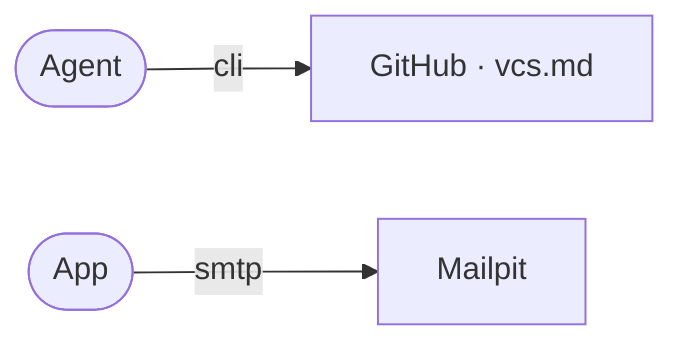

# Ecosystem

```mermaid
flowchart LR
  Agent([Agent])
  App([App])
  Vcs["GitHub · vcs.md"]
  Mailpit["Mailpit"]

  Agent -- cli --> Vcs
  App -- smtp --> Mailpit
```
## Services
- Mailpit is the local SMTP sink: every email, including codes and sign-in links, lands in its web inbox; nothing leaves the machine.
